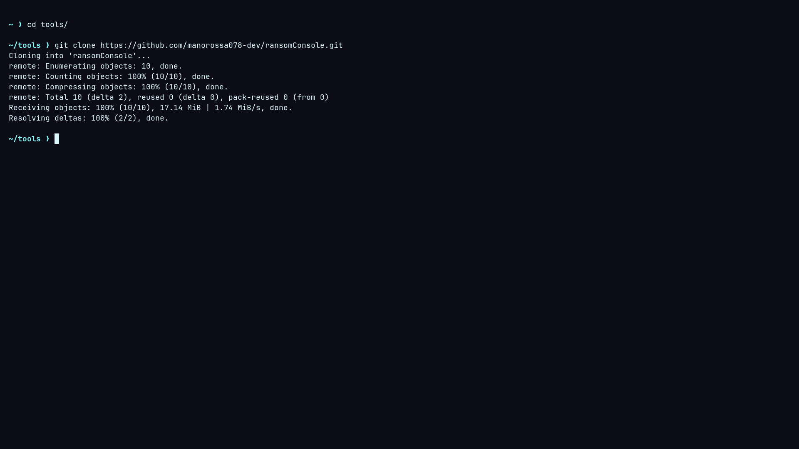
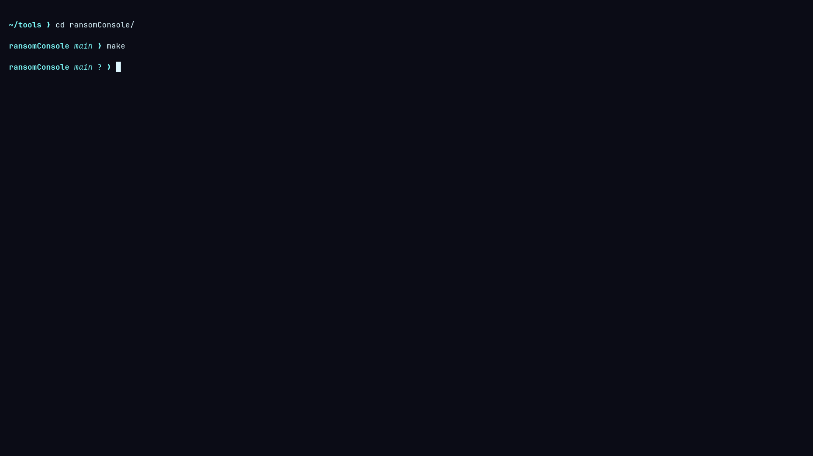
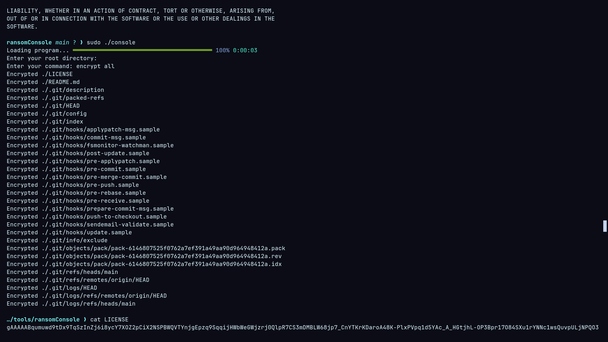

# ransomConsole
A simple and recursive ransomware that encrypts all files in the current directory and all of its sub-directories. WARNING: Do not use the "decrypt all" command without a key, or it'll damage the files and do not use the encrypt command on already encrypted files. Good luck.

Cloning:
```bash
git clone https://github.com/manorossa078-dev/ransomConsole.git
```


Setup:
```bash
cd ransomConsole/
make
```


Usage:
```bash
sudo ./console
[ su password ]
...
```


WARNING: the old "encrypt all" function has now changed to "encrypt.all" and same goes for decryption (decrypt.all).
